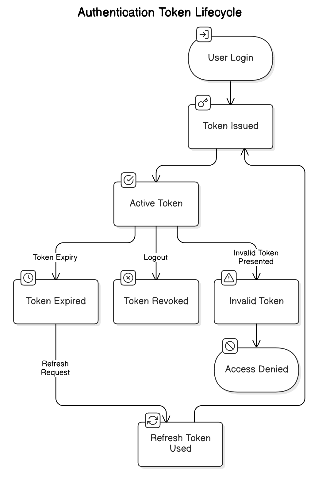

# Custos Project


This project is a backend API built with Node.js, Express, and MongoDB, designed to handle user authentication and account management. It includes features such as user registration, login, password reset, and account verification.

## Table of Contents

1. [Project Overview](#project-overview)
2. [Features](#features)
3. [Installation](#installation)
4. [Usage](#usage)
5. [API Documentation](#api-documentation)
6. [Diagrams](#diagrams)
7. [Contributing](#contributing)
8. [License](#license)

## Project Overview

Custos is a reusable authentication system designed to streamline and secure user authentication for API-based applications. Instead of building authentication from scratch for every new project, Custos provides a robust, scalable, and modular framework that can be easily integrated into any backend system.

### Key Features:
- Secure authentication with support for JWT, OAuth, and API key-based access.
- Modular and reusable design for seamless integration across multiple projects.
- Role-Based Access Control (RBAC) for fine-grained permission management.
- Session and token management to ensure secure user authentication.
- API-first approach, making it easy to integrate with modern web and mobile applications.
- Optimized for high performance and scalability.

### Why Use Custos?
- Saves development time by eliminating the need to build authentication from scratch.
- Implements industry-standard security practices to protect user data.
- Centralized authentication system for easier maintenance and management.
- Flexible integration with various backend frameworks and databases.

Custos is built for security, scalability, and efficiency, providing a solid authentication foundation for any API-driven project.


## Features

Custos provides a robust authentication system with essential security and access management capabilities.  

### Authentication & Authorization
- Supports **JWT**, **OAuth**, and **API key-based authentication**.
- Implements **Role-Based Access Control (RBAC)** for fine-grained permission management.
- Multi-factor authentication (MFA) support for enhanced security.

### Security & Token Management
- Secure **session handling** with token expiration and refresh mechanisms.
- **Password hashing and encryption** using industry-standard algorithms.
- Rate-limiting and brute-force protection to prevent unauthorized access.

### API & Integration
- **API-first approach**, making it easy to integrate with web and mobile applications.
- Support for multiple **database backends** (SQL and NoSQL).
- Webhooks and event-driven authentication workflows.

### Scalability & Performance
- Optimized for **high-traffic environments** with minimal performance overhead.
- Modular architecture for **easy customization and extension**.
- Lightweight and efficient, ensuring low resource consumption.

### Usability & Developer Experience
- Well-documented **RESTful API endpoints**.
- Plug-and-play implementation for fast deployment.
- Admin panel for **user management and monitoring** (if enabled).

Custos is designed to provide a **secure, scalable, and efficient** authentication system, reducing the complexity of managing user access in API-driven applications.


## Installation

Custos can be set up with either a local **Redis** server or a remote **Redis** instance, depending on your preference. The project uses **Node.js** and **npm** as the package manager.

### Prerequisites
- **Node.js** (LTS recommended)
- **npm** or **yarn**
- **Redis** (local or remote)

### Step 1: Clone the Repository
```sh
git clone https://github.com/your-repo/custos.git
cd custos
   ```
### Step 2: Install Dependencies
```sh
npm install
   ```
### Step 3: Configure Environment Variables
Create a .env file in the project root and configure the necessary environment variables:
```ini
MODE="dev" # pipeline state (dev or prod)
PORT=4000  # Server port

# Database Configuration
MONGO_URI_DEV=""  # db url connection dev
MONGO_URI_PROD=""  # db url connection prod

# Cross origin configuration
END_USER_WEB_DOMAIN_DEV=""
END_USER_WEB_DOMAIN_PROD=""

# Security Settings
SALTROUNDS=12  # Number of salt rounds for password hashing
API_KEY="" # API key for external services

# JWT Configuration
JWT_AUTH_SECRET=""  # Secret for auth tokens
JWT_REFRESH_SECRET=""  # Secret for refresh tokens
JWT_PASSWORD_RESET_SECRET=""  # Secret for password reset tokens
JWT_ACCOUNT_CONFIRMATION_SECRET=""  # Secret for account confirmation tokens
AUTH_TOKEN_EXPIRES_IN=""  # Auth token expiration time: example 2d
REFRESH_TOKEN_EXPIRES_IN=""  # Refresh token expiration time: example 2d
RESET_PASSWORD_TOKEN_EXPIRES_IN=""  # Password reset token expiration time: example 2d
ACCOUN_CONFIRMATION_TOKEN_EXPIRES_IN=""  # Password reset token expiration time: example 2d

SMTP_USER=""
SMTP_PASSWORD=""

# Redis Configuration
REDIS_URL=127.0.0.1  # Redis server host
REDIS_PORT=6379  # Redis server port

# Email Configuration
EMAIL_USER=""  # Email service username
EMAIL_PASS=""  # Email service password
EMAIL_NAME=""  # Email service name
   ```
### Step 4: Running the Application
For development mode (with hot-reloading):
```sh
npm run dev
   ```
For production mode:
```sh
npm start
   ```
### Step 5: Running Redis
If using a local Redis instance, start Redis before running the application:
```sh
redis-server
   ```
For a remote Redis server, update the REDIS_URL in the .env file.
### Step 6: Verify Setup
Once running, the authentication service should be accessible at:
```sh
http://localhost:4000/api/v1/auth
   ```
You can test the API endpoints using Swagger UI at:
```sh
http://localhost:4000/api/v1/documentation/
   ```
Custos is now set up and ready to use.
## Usage

Custos provides a secure authentication system with multiple endpoints for user management and access control. Below are the key actions you can perform.

### Register a New User
- **Endpoint:** `POST /auth/register`
- **Description:** Create a new user account.
- **Required Fields:** `email`, `password`, `passwordConfirmation`
- **Response:** A success message and user details if registration is successful.

### Login
- **Endpoint:** `POST /auth/login`
- **Description:** Authenticate a user and obtain an access token.
- **Required Fields:** `email`, `password`
- **Response:** Returns an access token and refresh token.

### Verify Account
- **Endpoint:** `PUT /auth/account-verification`
- **Description:** Verify a newly registered user account using the token sent via email.
- **Required:** Bearer token in the `Authorization` header.
- **Response:** Confirmation message upon successful verification.

### Resend Verification Email
- **Endpoint:** `POST /auth/resend-new-confirmation-email`
- **Description:** Request a new confirmation email if the previous one expired.
- **Required Fields:** `email`
- **Response:** A confirmation email is sent again.

### Reset Password (Forgot Password)
- **Step 1: Request Password Reset**
  - **Endpoint:** `POST /auth/forgot-password`
  - **Description:** Request a password reset link.
  - **Required Fields:** `email`
  - **Response:** Reset instructions sent to the user's email.

- **Step 2: Reset the Password**
  - **Endpoint:** `PUT /auth/reset-password`
  - **Description:** Reset the password using the token received via email.
  - **Required Fields:** `password`, `passwordConfirmation`
  - **Required:** Bearer token in `Authorization` header.
  - **Response:** Password reset confirmation.

### Check Token Validity
- **Endpoint:** `GET /auth/check-access-token`
- **Description:** Validate an access token and retrieve user details.
- **Required:** Bearer token in `Authorization` header.
- **Response:** User details if the token is valid.

### Refresh Access Token
- **Endpoint:** `POST /auth/refresh-access-token`
- **Description:** Generate a new access token using a refresh token.
- **Required:** `x-refresh-token` in the request header.
- **Response:** A new access token.

### Logout
- **Endpoint:** `POST /auth/logout`
- **Description:** Invalidate access and refresh tokens to log out the user.
- **Required:** Bearer token in `Authorization` header and `x-refresh-token`.
- **Response:** Confirmation of successful logout.

These endpoints allow you to fully manage user authentication and session security.


## API Documentation

The API is documented using Swagger. You can access the documentation at `http://localhost:4000/api/v1/documentation/` once the server is running.

## Diagrams
#### Use Case Diagram (User Registration)

#### Sequence Diagram (User Registration Flow)

#### Activity Diagram (User Registration Process)

#### Deployment Diagram (Authentication System Infrastructure)

#### Component Diagram (Authentication System Architecture)

#### State Machine Diagram (Authentication Token Lifecycle)

#### API Flow Diagram (Request-Response Cycle in Authentication System)

#### Use Case Diagram (User Login)

#### Sequence Diagram (User Login Flow)

#### Activity Diagram (User Login Process)


## Contributing

Contributions are welcome! Please fork the repository and submit a pull request for any improvements or bug fixes.

## License

This project is licensed under the MIT License. See the [LICENSE](LICENSE) file for details.
